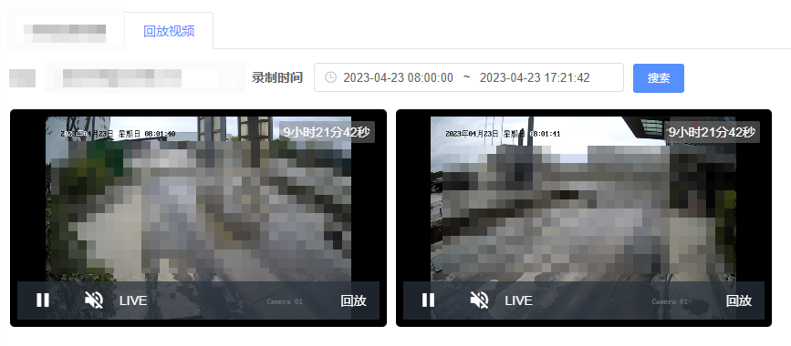

<p align="center">
    海康sdk starter
</p>

<p align="center">
    <a href="https://www.apache.org/licenses/LICENSE-2.0">
        
   </a>

  <a href="https://jitpack.io/#waimifeier/hikvision-spring-boot-starter">
    
  </a>

</p>

# 项目介绍

基于海康威视网络摄像机和NVR录像机的SDK二次开发, 为解决web-sdk播放控件兼容性不友好(只能在低版本浏览器下才能播放)，rtsp回放延迟问题(8s以上延迟)，和多端设备播放兼容等问题。 主要实现了sdk实时预览、回放、抓图等功能, rtsp推流 （无需nginx推流即可播放）
缺点：包文件比较大，占网络带宽、播放次数过大，耗cpu资源。

目前海康大华摄像头都支持GB28181协议，对于播放要求比较高的话，可以考虑这个方向。 目前已经实现了部分功能。 [`感兴趣可看看`](https://blog.csdn.net/waimifeier/article/details/140696306)。

## 快速开始

### maven 依赖

指定仓库地址
```xml
<repositories>
    <repository>
        <id>jitpack.io</id>
        <url>https://jitpack.io</url>
    </repository>
</repositories>
```

maven 坐标
```xml
<dependency>
    <groupId>com.github.waimifeier</groupId>
    <artifactId>hikvision-spring-boot-starter</artifactId>
    <version>1.2.10</version> 
</dependency>
```


### 项目配置
> 海康sdk库文件需要去[`海康官网下载`](https://open.hikvision.com/download/5cda567cf47ae80dd41a54b3?type=undefined) ,区分window版和linux版
```yaml
# 配置海康威视 sdk 位置
hik:
  sdk-path: classpath:sdk/win
```


## 案例
### rtsp推流

#### 1.rtsp 实时预览

```java
@GetMapping(value = "/video/rtspReal.flv",produces = {"video/x-flv;charset=UTF-8"})
public void flvRtspReal(HttpServletResponse response,HttpServletRequest request){

    AsyncContext asyncContext = request.startAsync();
    asyncContext.setTimeout(0);

    String rtspUrl = HkUtils.toRtspUrl("ip", "推流端口", "账号", "密码","通道号");
    try {
        HkUtils.rtspToFlv(rtspUrl,asyncContext);
    }catch (Exception e){
        e.printStackTrace();
    }
}
```
#### 2.rtsp回放预览
> 目前接入的海康设备rtsp回放不太稳定，会经常播放不了(不知道是不是设备的问题)，即使能播放也有很大的延迟

```java
@GetMapping(value = "/video/rtspBack.flv",produces = {"video/x-flv;charset=UTF-8"})
public void flvRtspBack(HttpServletResponse response,HttpServletRequest request){

    AsyncContext asyncContext = request.startAsync();
    asyncContext.setTimeout(0);
    // 获取rtsp回放地址
    String rtspUrl = HkUtils.toRtspUrl("ip", "推流端口", "账号", "密码","通道号","2023-03-10 12:00:00","2023-03-10 13:00:00");
    try {
        HkUtils.rtspToFlv(rtspUrl,asyncContext);
    }catch (Exception e){
        e.printStackTrace();
    }
}
```

### sdk推流
> sdk 推流，实际上就是调用了海康的sdk，完成了一次播放预览，通过抓流得到码流数据。 播放画面过多，比较耗性能。
#### 1. sdk 实时预览

```java
/**
 * 实时预览
 */
@GetMapping(value = "/video/sdkReal.flv",produces = {"video/x-flv;charset=UTF-8"})
public void flvSdkReal(HttpServletResponse response,HttpServletRequest request){

        AsyncContext asyncContext = request.startAsync();
        asyncContext.setTimeout(0);

        // sdk抓流，必须登陆
        CameraLogin cameraLogin = HkUtils.doLogin("ip", "端口", "账号", "密码");

        // sdk开启实时预览 （参数二为通道号，可从登陆信息获取到）
        VideoPreview videoPreview = HkUtils.startRelaPlay(cameraLogin.getUserId(),17);
        PipedOutputStream outputStream = videoPreview.getOutputStream();
        PipedInputStream inputStream=new PipedInputStream();
        try {
           // 使用抓流器进行转码
           inputStream.connect(outputStream);
           HkUtils.streamToFlv(inputStream,outputStream,asyncContext,videoPreview.getPlayHandler());
        }catch (Exception e){
            e.printStackTrace();
        }
    }
```

#### 2. sdk 回放预览
```java

/**
 * 回放预览
 */
@GetMapping(value = "/video/sdkBack.flv",produces = {"video/x-flv;charset=UTF-8"})
public void flvSdkBack(HttpServletResponse response,HttpServletRequest request){

        AsyncContext asyncContext = request.startAsync();
        asyncContext.setTimeout(0);

        // sdk抓流，必须登陆
        CameraLogin cameraLogin = HkUtils.doLogin("ip", "端口", "账号", "密码");

        // 使用sdk开启回放预览 （参数二为通道号，可从登陆信息获取到）
        VideoPreview videoPreview = HkUtils.startBackPlay(cameraLogin.getUserId(),17,"开始时间","结束时间");
        PipedOutputStream outputStream = videoPreview.getOutputStream();
        PipedInputStream inputStream=new PipedInputStream();
        try {
            inputStream.connect(outputStream);
            HkUtils.streamToFlv(inputStream,outputStream,asyncContext,videoPreview.getPlayHandler());
        }catch (Exception e){
            e.printStackTrace();
        }
    }
```

### 前端播放实现
> 推荐使用播放器 [LivePlayer](https://www.liveqing.com/docs/manuals/LivePlayer.html) 或 [xgplayer](https://v2.h5player.bytedance.com/gettingStarted/) 


效果展示: 

